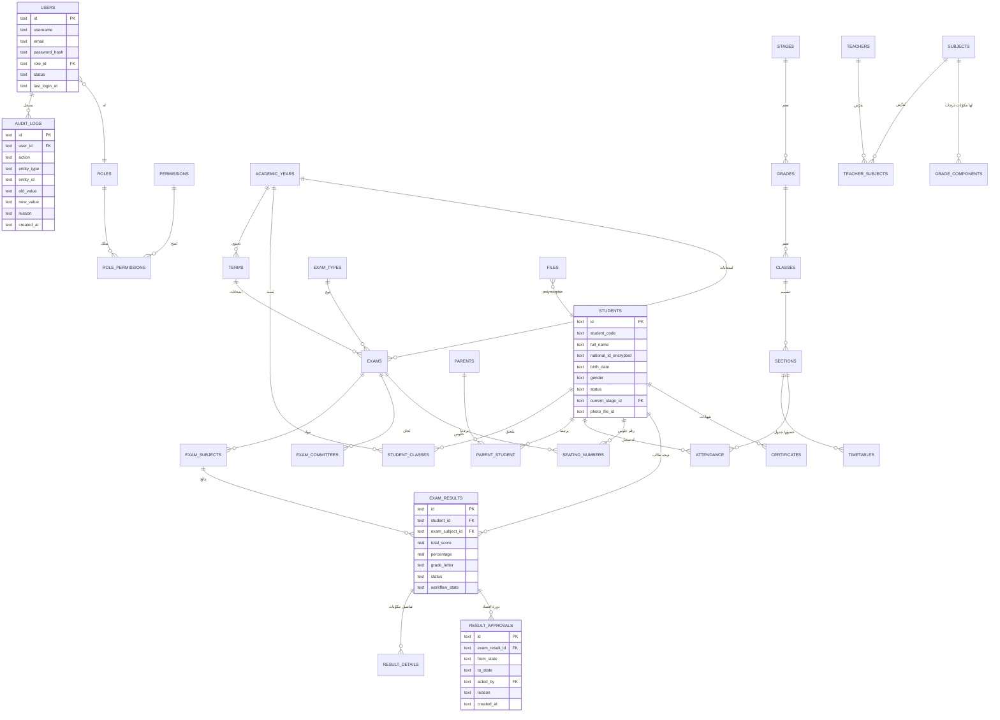

# ERD — مخطط قاعدة البيانات (Cloudflare D1 / SQLite)

> ملاحظة: SQLite لا يدعم ENUM حقيقي، لذا تُستخدم `TEXT` مع `CHECK` constraints.
> كل الجداول تحمل `id TEXT PRIMARY KEY` (UUID) ما لم يُذكر غير ذلك،
> بالإضافة إلى `created_at`, `updated_at` (تلقائية).



## الجداول الكاملة (قائمة مرجعية)

```
users, roles, permissions, role_permissions, sessions,
academic_years, terms, stages, grades, classes, sections,
subjects, student_classes, teacher_subjects,
students, parents, parent_student, teachers, staff,
timetables, attendance,
exam_types, exams, exam_subjects, exam_committees, seating_numbers,
grade_components, exam_results, result_details, result_approvals,
certificates, files,
announcements, notifications, messages, activities,
school_settings, audit_logs, backup_logs
```

راجع `worker/migrations/0001_init.sql` للتعريف الكامل بأنواع الأعمدة والقيود.
